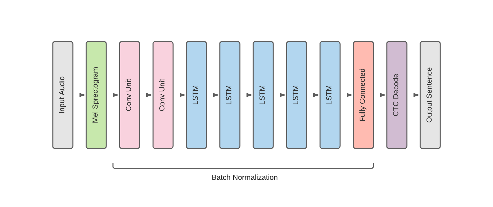

# ASR_persian
Automatic Speech Recognition
ASR_persian is an project with the purpose of converting input audio into text. 
This project is totally based on DeepSpeech.Pytorch on Github.
## Model Architecture
|  | 
|:--:| 
| *ASR: DeepSpeech Model Overview* |


## Parametes
In this part desired initial configuration is defined in detail. 
### configs/mozilla
- gpus: number of gpu to use
- save_top_k: Number of best models to save
- dirpath: Model path in output directory to save k best models.

### deepspeech_pytorch/configs/train_config
- augmentation: Data augmentation configs. including noise inhection, spectogram augmentation and changing gain.
- load_auto_checkpoint: Path to load model checkpoined. 
- transfer_checkpoint: Path to load English pretrained model.
- data: Dataset and labels information.

### deepspeech_pytorch/configs/inference_config
- decoder: greedy/beamsearch
- alpha, beta: beamsearch language model parameters.
- model_path: Path to load model.
- test_path: Test data path.

## Run
### Train 
First you should train model with configuration specified in the config file. Becareful to follow the mozilla config file foramt. 
```
python train.py configs=mozilla
```
### Inference:
Run test.py in odrer to test trained model. 
```
python test.py
```

### Tune beam decoder
```
python search_lm_params.py
```
